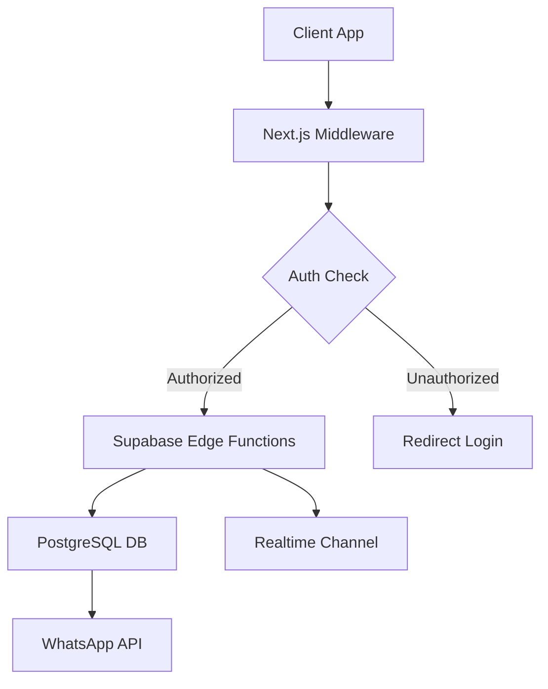

### 📄 Archivo de Contexto: `tech_architecture_and_auth.md`

```markdown
# System Architecture & Authentication Features

## 🏗️ Core Architecture (BaaS Strategy)
**Mandatory Stack:**
- **Backend:** Supabase (Auth, PostgreSQL, Realtime, Storage, Edge Functions).
- **Frontend:** Next.js 14 (App Router) hosted on Vercel.
- **Security/CDN:** Cloudflare (DDoS protection, Caching).
- **External:** WhatsApp Business API for notifications.

### 🔄 Data Flow Architecture


## 🔐 Authentication & User Management

### 1. Auth Strategy (OAuth 2.0)

* **Providers:** Google, Facebook, Email (Magic Link/Password).
* **Flow:**
1. User triggers action (e.g., "Add to Cart").
2. If `!user`, show **Minimalist Auth Modal**.
3. On Success -> Check `profiles` table.
4. **Onboarding Logic:** If `phone` or `default_address` is null -> Trigger **Onboarding Wizard**.

### Auth Flow
The application must follow this strict decision tree:
```mermaid
graph TD
    A[Usuario visita Landing] --> B{¿Autenticado?}
    B -->|No| C[Mostrar CTA Login]
    B -->|Sí| D[Mostrar Avatar/Menu]
    C --> E[Modal de Auth Minimalista]
    E --> F[OAuth Providers (Google/FB)]
    F --> G[Callback Supabase]
    G --> H{¿Faltan datos?}
    H -->|Sí (Phone/Address)| I[Trigger Onboarding Wizard]
    H -->|No| J[User Dashboard]


### 2. Role-Based Access Control (RBAC)

Define strictly in `types/auth.types.ts`:

* **Customer:** Can view menu, order, view own history.
* **Admin:** Can edit menu, view all orders, change order status.
* **Super Admin:** Manage users, access analytics, system settings.

### 3. Database Schema (Supabase SQL)

You must enforce Row Level Security (RLS) on all tables.

```sql
-- Core Profiles Table
CREATE TABLE profiles (
  id UUID REFERENCES auth.users PRIMARY KEY,
  email TEXT UNIQUE NOT NULL,
  role TEXT DEFAULT 'customer', -- 'admin', 'super_admin'
  phone TEXT,
  default_address TEXT,
  avatar_url TEXT
);

-- Orders Table
CREATE TABLE orders (
  id UUID DEFAULT uuid_generate_v4() PRIMARY KEY,
  user_id UUID REFERENCES profiles(id),
  items JSONB NOT NULL, -- Snapshot of items at time of purchase
  total DECIMAL(10,2),
  status TEXT DEFAULT 'pending', -- 'confirmed', 'preparing', 'delivered'
  delivery_address TEXT
);

```

## 🎨 UI/UX Component Specifications

### Header & Navigation

* **State:** Must use `useAuth` hook to toggle between "Login Button" and "User Avatar/Menu".
* **Visual:** Backdrop blur `bg-white/90`. Sticky positioning.

### Minimalist Auth Modal

* **Design:** Clean, gradient header (`from-gray-50 to-white`).
* **Feedback:** Must show specific error messages (e.g., "Email already in use").
* **Socials:** Use branded icons for Google/Facebook.

### Digital Order Ticket (The "Wow" Factor)

* **Visual:** Cartoon-style ticket with a perforated line effect (CSS/SVG).
* **Animation:** `framer-motion` scale effect on appearance.
* **Content:** List of items with emojis, Total in Accent Color, QR Code.
* **Actions:** "Share to WhatsApp", "Download PDF".

## 🛠️ Admin Dashboard Features

* **Route Protection:** Middleware must block `/admin` for non-admin roles.
* **Menu Editor:**
* WYSIWYG interface.
* Live preview card next to the form.
* Image upload with auto-optimization via Supabase Storage.


* **Metrics:** Track "Top Selling Items" and "Peak Hours".

## 📱 WhatsApp Integration Logic

* **Trigger:** On `order_insert` (Database Webhook) or Client-side completion.
* **Format:**
```text
¡Hola [Nombre]! 🌮
Confirmamos tu orden #[ID-CORTO]:
- 2x Tacos ($X)
- 1x Coca ($Y)
Total: $Z

📍 Enviando a: [Dirección]
⏱️ Tiempo: 30-45 min

```

## 📅 Implementation Roadmap (Summary)

1. **Foundation (W1):** Setup Supabase, OAuth, and Base Layout.
2. **Core (W2-3):** Landing Page, Digital Menu, Cart Logic.
3. **Admin (W4-5):** Dashboard, Menu CRUD, Order Management.
4. **UX Polish (W6):** Onboarding Wizard, PWA, Offline mode.
5. **Launch (W7-8):** Testing, WhatsApp API config, Deploy.

```

---

### 🖼️ Diagramas de Apoyo para la IA

Para asegurarnos de que la IA entienda el flujo visual y de datos, puedes "inyectar" estos diagramas visuales en tu prompt si sientes que se pierde:

**1. Flujo de Autenticación y Onboarding:**


**2. Arquitectura de Base de Datos:**


---

### 🚀 Cómo usar este archivo

1.  Guarda el contenido en un archivo llamado `tech_architecture_and_auth.md`.
2.  Cuando pidas una tarea compleja (ej. "Crea el flujo de login"), usa este prompt:


